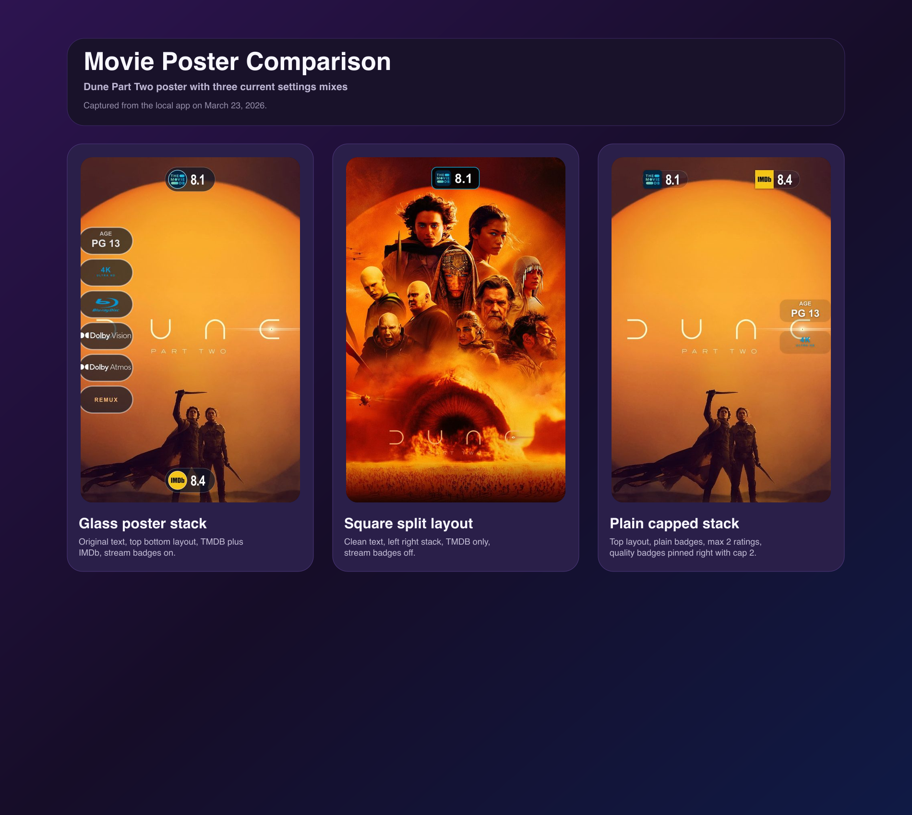
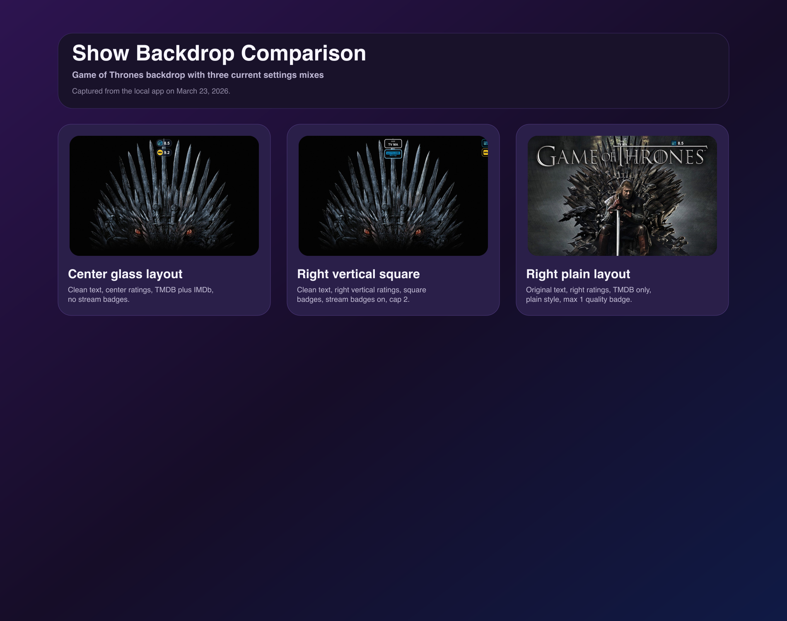
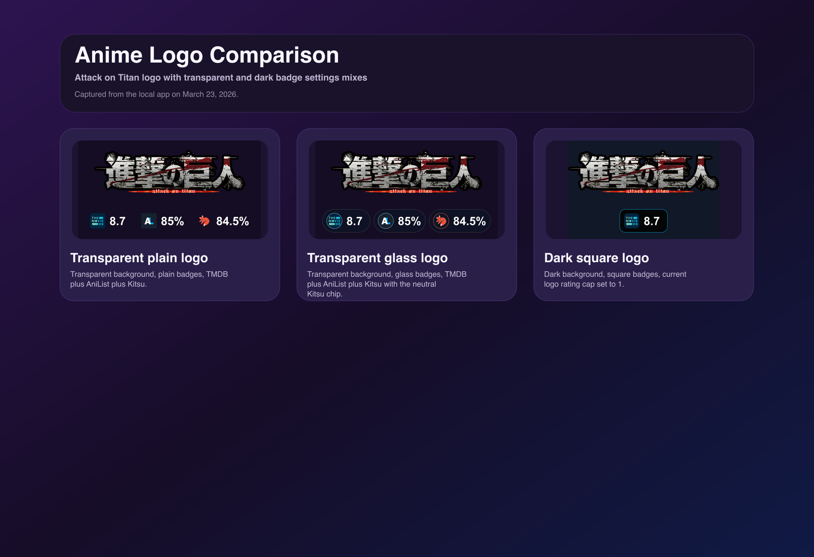
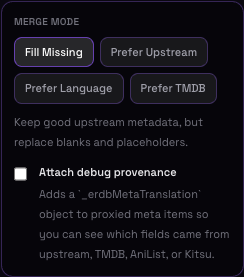
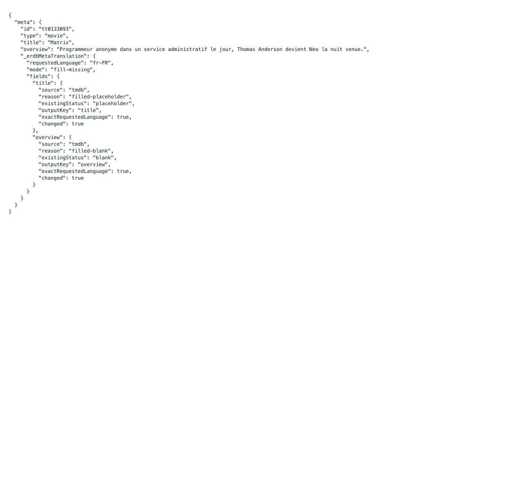
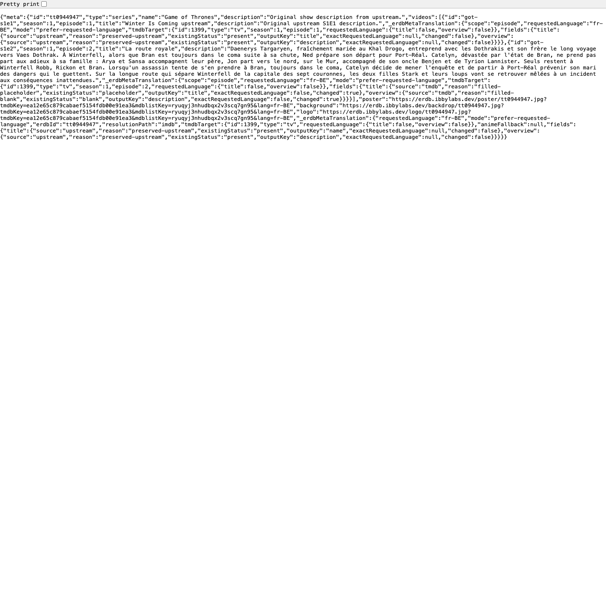
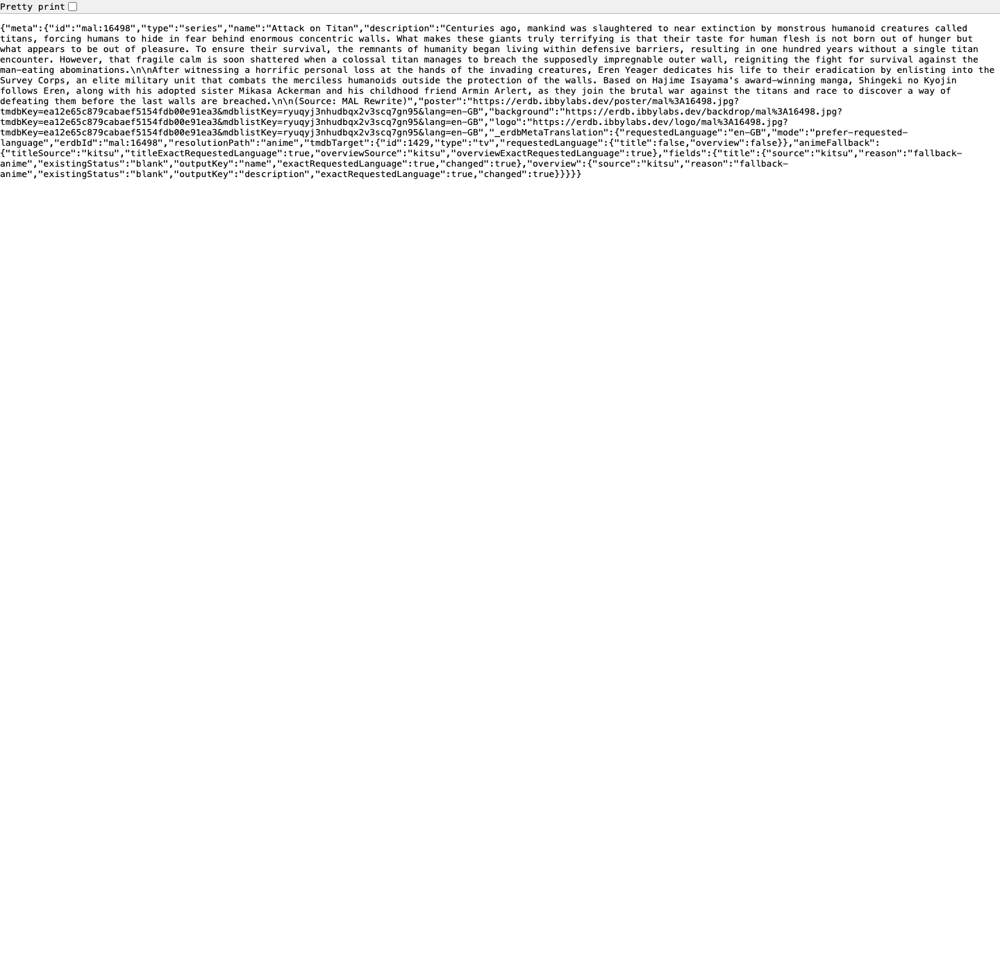
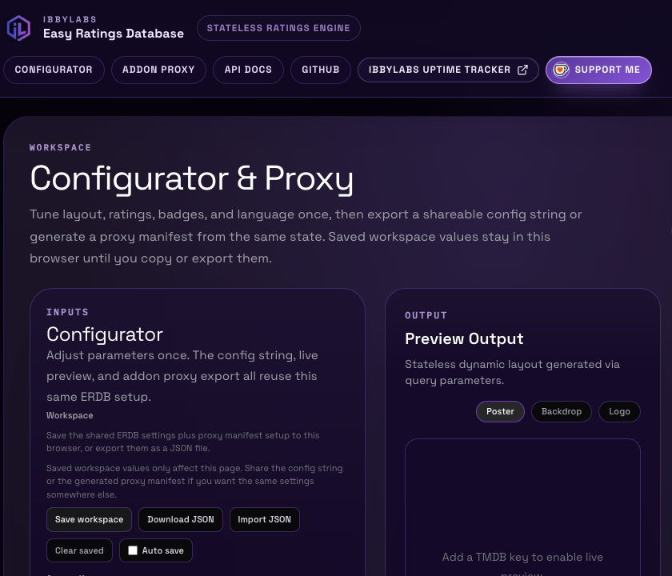
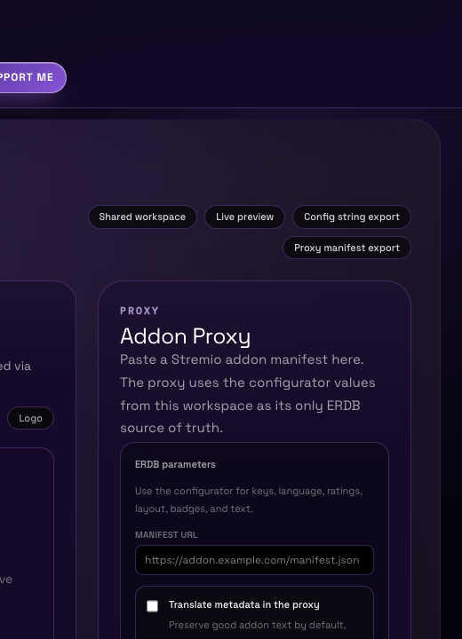

# Easy Ratings Database (ERDB): Stateless Edition

ERDB generates poster/backdrop/logo images with dynamic ratings on the fly.

<!-- changelog-links:start -->

> [!TIP]
> **Changelog:** read the [full changelog](CHANGELOG.md) or jump straight to the [latest entry](CHANGELOG.md#v2-33-0).

<!-- changelog-links:end -->

## Quick Start

## Install From GitHub

```bash
git clone https://github.com/IbbyLabs/erdb
cd erdb
```

Use Node 22.x locally. The repo now includes `.nvmrc` and `.node-version` so native packages such as `better-sqlite3` stay aligned with CI and release scripts.

1. Install dependencies: `sudo npm install`
2. Build: `npm run build`
3. Start the app: `npm run start`
4. App available at `http://localhost:3000`

## Stateless Architecture & API Keys (BYOK)

ERDB is designed with a **Bring Your Own Key (BYOK)** stateless architecture. 
This means that the ERDB server itself does not permanently store or centrally manage your TMDB, MDBList, or optional Fanart API keys. Instead:

1. Keys are saved locally in your browser's `localStorage` when using the configurator UI.
2. Keys are embedded directly into your generated URLs (`tmdbKey=...&mdblistKey=...&fanartKey=...`) and Addon proxy Base64 configurations when present.
3. The server solely reads these keys from incoming requests to fetch upstream metadata on the fly.

This intentional design allows you to host public ERDB proxy instances without paying for massive shared API usage, as every connected addon or user brings their own API key and rate limits. The visibility of keys in URLs and the configurator UI is expected behavior.

Optional server side client ids can extend a few providers beyond the BYOK flow. `ERDB_MAL_CLIENT_ID` enables the official MyAnimeList API path for direct `myanimelist` ratings, and `ERDB_TRAKT_CLIENT_ID` enables direct `trakt` ratings. When the MAL client id is not configured, ERDB falls back to Jikan for direct `myanimelist` lookups before falling back to MDBList whenever a `mdblistKey` is present. Fanart backed artwork can also use a server fallback key from `ERDB_FANART_API_KEY` or `FANART_API_KEY`, but a user supplied `fanartKey` is preferred when available.

## Live Preview Gallery

These are live requests against production so readers can see current poster, backdrop, and logo output directly inside GitHub.

The gallery is intended to use the optional server side preview env vars `ERDB_README_PREVIEW_TMDB_KEY` and `ERDB_README_PREVIEW_MDBLIST_KEY` so the README does not need to expose a raw API key.

Each preview URL includes a `cb` cache buster token. The release flow refreshes those tokens automatically so GitHub fetches a fresh set of live previews on each tagged release.

### Posters

<table>
  <tr>
    <td><strong>The Boys</strong><br>Glass ratings, stream badges, original text</td>
    <td><strong>Dune Part Two</strong><br>Square ratings, clean text, compact layout</td>
    <td><strong>Attack on Titan</strong><br>Japanese text, anime ratings, poster stack</td>
  </tr>
  <tr>
    <td><a href="https://erdb.ibbylabs.dev/preview/the-boys-poster?cb=readme-preview-the-boys-poster-v2-33-0"></a></td>
    <td><a href="https://erdb.ibbylabs.dev/preview/dune-part-two-poster?cb=readme-preview-dune-part-two-poster-v2-33-0"></a></td>
    <td><a href="https://erdb.ibbylabs.dev/preview/attack-on-titan-poster?cb=readme-preview-attack-on-titan-poster-v2-33-0"></a></td>
  </tr>
</table>

### Backdrops

<table>
  <tr>
    <td><strong>Game of Thrones</strong><br>French backdrop, right side ratings</td>
    <td><strong>Stranger Things</strong><br>Square ratings, stream badges, left side stack</td>
  </tr>
  <tr>
    <td><a href="https://erdb.ibbylabs.dev/preview/game-of-thrones-backdrop?cb=readme-preview-game-of-thrones-backdrop-v2-33-0"></a></td>
    <td><a href="https://erdb.ibbylabs.dev/preview/stranger-things-backdrop?cb=readme-preview-stranger-things-backdrop-v2-33-0"></a></td>
  </tr>
</table>

### Logos

<table>
  <tr>
    <td><strong>The Boys</strong><br>Dark canvas, glass ratings</td>
    <td><strong>Attack on Titan</strong><br>Japanese logo with anime ratings</td>
  </tr>
  <tr>
    <td><a href="https://erdb.ibbylabs.dev/preview/the-boys-logo?cb=readme-preview-the-boys-logo-v2-33-0"></a></td>
    <td><a href="https://erdb.ibbylabs.dev/preview/attack-on-titan-logo?cb=readme-preview-attack-on-titan-logo-v2-33-0"></a></td>
  </tr>
</table>


## Rendering Option Comparisons

These static comparison boards highlight the newer rendering controls that are easier to evaluate side by side than in a single live card. They cover `logoBackground`, `logoRatingsMax`, `posterQualityBadgesMax`, `backdropQualityBadgesMax`, and a few layout and style combinations from the local March 23, 2026 build.

The current quality badge behavior uses local asset based artwork for 4K, Bluray, HDR10, Dolby Vision, and Dolby Atmos. Certification badges also include a small `AGE` label above the rating so age ratings read more clearly at a glance.

Transparent provider icons now stay transparent across every badge style. In `glass`, icons with transparency such as Kitsu render on a neutral inner chip with an accent ring so the accent color does not bleed through the icon cutouts.

### Movie Poster Options

<p align="center">
  
</p>

### Show Backdrop Options

<p align="center">
  
</p>

### Anime Logo Options

<p align="center">
  
</p>

## Scalability & Docker

The compose file includes a reverse proxy (Caddy) to handle app scaling.

## Releases & Packages

Pushing a version tag that matches `v*` now starts two independent workflows:

- publishes a GitHub release with notes sourced from the matching changelog entry
- pushes a multi architecture container image to GHCR as `ghcr.io/ibbylabs/erdb`

The GitHub release is no longer blocked on the Docker publish job finishing.

Pull examples:

```bash
docker pull ghcr.io/ibbylabs/erdb:latest
docker pull ghcr.io/ibbylabs/erdb:v2.1.0
```

Release flow:

```bash
npm run release:patch
```

Store `ERDB_README_PREVIEW_TMDB_KEY` and `ERDB_README_PREVIEW_MDBLIST_KEY` in local `.env` or `.env.local` if you want the release/doc asset scripts to pick them up automatically. Shell exported vars still win if both are set.

If the GHCR package already existed before it was linked to this repository, open the package in GitHub and:

1. connect it to `IbbyLabs/erdb`
2. enable permission inheritance from the repository
3. set visibility to public if you want anonymous pulls

## Recommended Requirements

For high performance (on the fly image rendering), a server with a strong CPU and plenty of RAM is recommended.

Minimum recommended:
- CPU: 4 vCPU
- RAM: 4 GB

Basic start:
```bash
docker compose up -d --build
```

If you are using the bundled Docker setup, the app should bind internally to `0.0.0.0`.
Set `ERDB_BIND_HOST=0.0.0.0` in the same `.env` file that `docker compose` reads if you need to override it explicitly.
This is only the container bind host. It is not your public domain name.

Scale to multiple instances (e.g. 4):
```bash
docker compose up -d --build --scale app=4
```

The public port is `ERDB_HTTP_PORT` (default `3000`) exposed by Caddy. Set it in the `.env` file.
Data (SQLite database and image cache) is persisted in `./data`.

Custom port (with scale):
```bash
ERDB_HTTP_PORT=4000 docker compose up -d --build --scale app=4
```
## HuggingFace Guide (NOT RECOMMENDED)

(to avoid bans on HuggingFace)
1. Go to the ERDB GitHub repo: https://github.com/IbbyLabs/erdb
2. Click the "Fork" button in the top right corner
3. Choose any name for the fork (do not use "erdb")

### HuggingFace Steps

1. Create a new Space
2. Choose any name
3. Select Docker
4. Select Blank
5. Set it as a Public space
6. Click Create Space

Now click "Create the Dockerfile" (near the bottom of the page).

Copy and paste the content of `Dockerfile.hf` into the editor that opens,
replacing "IbbyLabs" with your GitHub username.

Line to change:

```text
RUN git clone https://github.com/IbbyLabs/erdb.git .
```

After the edit, click "Commit new file to main".

### ERDB URL

To get your personal link:

1. Click the three dots in the top right corner
2. Go to "Embed this Space"
3. Copy the Direct URL

Done! Your ERDB is ready to use on HuggingFace.

Note: to update ERDB quickly, go to the Space settings and click
"Factory Rebuild" only after syncing your fork on GitHub.

## API Usage

Main endpoint:
`GET /{type}/{id}.jpg?ratings={providers}&lang={lang}&ratingStyle={style}...`

### Examples
- **Poster with IMDb and TMDB**: `/poster/tt0133093.jpg?ratings=imdb,tmdb&lang=en`
- **Plain backdrop**: `/backdrop/tmdb:movie:603.jpg?ratings=mdblist&style=plain&backdropRatingsLayout=right vertical`

### Supported Query Parameters

| Parameter | Description | Supported Values | Default |
|-----------|-------------|------------------|---------|
| `type` | Image type (Path) | `poster`, `backdrop`, `logo` | - |
| `id` | Media ID (Path) | IMDb (`tt...`), TMDB (`tmdb:id`, `tmdb:movie:id`, `tmdb:tv:id`), Kitsu (`kitsu:id`), anime IDs such as `anilist:123` or `mal:456` | - |
| `lang` | Image language | Any TMDB ISO 639-1 code (e.g. `it`, `en`, `es`, `fr`, `de`, `ru`, `ja`) | `en` |
| `genreBadge` | Genre badge mode (global) | `off`, `text`, `icon`, `both` | `off` |
| `streamBadges` | Quality badges via Torrentio (global fallback) | `auto`, `on`, `off` | `auto` |
| `posterStreamBadges` | Poster quality badges | `auto`, `on`, `off` | `auto` |
| `backdropStreamBadges` | Backdrop quality badges | `auto`, `on`, `off` | `auto` |
| `qualityBadgesSide` | Quality badges side (poster `top bottom` layout only) | `left`, `right` | `left` |
| `posterQualityBadgesPosition` | Quality badges side for poster `top` or `bottom` layouts | `auto`, `left`, `right` | `auto` |
| `qualityBadgesStyle` | Quality badges style (global fallback) | `glass`, `square`, `plain`, `media` | `glass` |
| `posterQualityBadgesStyle` | Poster quality badges style | `glass`, `square`, `plain`, `media` | `glass` |
| `backdropQualityBadgesStyle` | Backdrop quality badges style | `glass`, `square`, `plain`, `media` | `glass` |
| `posterQualityBadgesMax` | Poster quality badge limit | Number (1-20) | `auto` |
| `backdropQualityBadgesMax` | Backdrop quality badge limit | Number (1-20) | `auto` |
| `ratingPresentation` | Rating presentation mode (global fallback) | `standard`, `minimal`, `average`, `dual`, `blockbuster` | `standard` |
| `aggregateRatingSource` | Aggregate source for `minimal` and `average` (global fallback) | `overall`, `critics`, `audience` | `overall` |
| `aggregateAccentMode` | Aggregate accent source | `source`, `genre`, `custom` | `source` |
| `aggregateAccentColor` | Aggregate accent color when `aggregateAccentMode=custom` | Hex color | `#a78bfa` |
| `aggregateAccentBarOffset` | Average badge accent bar offset | Number (-12 to 12) | `0` |
| `ratings` | Rating providers (global fallback) | `tmdb, mdblist, imdb, tomatoes, tomatoesaudience, letterboxd, metacritic, metacriticuser, trakt, rogerebert, myanimelist, anilist, kitsu` | `all` |
| `posterRatings` | Poster rating providers | `tmdb, mdblist, imdb, tomatoes, tomatoesaudience, letterboxd, metacritic, metacriticuser, trakt, rogerebert, myanimelist, anilist, kitsu` | `all` |
| `backdropRatings` | Backdrop rating providers | `tmdb, mdblist, imdb, tomatoes, tomatoesaudience, letterboxd, metacritic, metacriticuser, trakt, rogerebert, myanimelist, anilist, kitsu` | `all` |
| `logoRatings` | Logo rating providers | `tmdb, mdblist, imdb, tomatoes, tomatoesaudience, letterboxd, metacritic, metacriticuser, trakt, rogerebert, myanimelist, anilist, kitsu` | `all` |
| `ratingStyle` (or `style`) | Badge style | `glass` (Pill), `square` (Dark), `plain` (No BG) | `glass` (poster/backdrop), `plain` (logo) |
| `tmdbKey` | TMDB v3 API Key (Stateless) | String (e.g. `your_key`) | **Required** |
| `mdblistKey` | MDBList API Key (Stateless) | String (e.g. `your_key`) | Required for MDBList backed ratings |
| `fanartKey` | Fanart API Key for fanart poster, backdrop, and logo sources | String (e.g. `your_key`) | Server fallback when available |
| `imageText` | Image text (poster/backdrop only) | `original`, `clean`, `alternative` | `original` (poster), `clean` (backdrop) |
| `posterArtworkSource` | Poster artwork source | `tmdb`, `fanart` | `tmdb` |
| `backdropArtworkSource` | Backdrop artwork source | `tmdb`, `fanart` | `tmdb` |
| `posterRatingsLayout` | Poster layout | `top`, `bottom`, `left`, `right`, `top bottom`, `left right` | `top bottom` |
| `posterRatingsMaxPerSide` | Max badges per side | Number (1+) | `auto` |
| `backdropRatingsLayout` | Backdrop layout | `center`, `right`, `right vertical` | `center` |
| `logoRatingsMax` | Logo badge limit | Number (1+) | `auto` |
| `logoBackground` | Logo canvas background | `transparent`, `dark` | `transparent` |
| `logoArtworkSource` | Logo artwork source | `tmdb`, `fanart` | `tmdb` |

In the configurator UI, `minimal` is labeled as `Compact Average`, `average` is labeled as `Labeled Average`, and `dual` is labeled as `Critics + Audience`. The underlying query values stay `minimal`, `average`, and `dual`.

`myanimelist` and `trakt` can render directly when the server has `ERDB_MAL_CLIENT_ID` or `ERDB_TRAKT_CLIENT_ID`. Without the MAL client id, ERDB falls back to Jikan for direct `myanimelist` ratings. When direct lookups are unavailable, ERDB still falls back to MDBList when `mdblistKey` is present.

Prefer `tmdb:movie:id` or `tmdb:tv:id` when you already know the media type. Bare `tmdb:id` still works, but explicit TMDB IDs avoid movie vs TV collisions.

Transparent provider icons stay transparent across `glass`, `square`, and `plain`. In `glass`, ERDB switches icons with transparency such as Kitsu to a neutral inner chip with an accent ring to avoid accent color bleed through.

Genre badges resolve from a curated family set instead of trying to icon map every TMDB genre. Strong buckets such as horror, comedy, sci fi, fantasy, crime, documentary, and anime render; ambiguous combinations stay off.

`fanartKey` is optional. If present, ERDB uses your key first for fanart requests. If it is blank, ERDB falls back to `ERDB_FANART_API_KEY` or `FANART_API_KEY` when the server has one.

Poster `posterArtworkSource=fanart` uses fanart.tv poster art for `original`, `clean`, and `alternative`. Original and clean use the top ranked fanart image. Alternative uses the next ranked fanart image when one exists.

Backdrop `backdropArtworkSource=fanart` uses fanart.tv `moviebackground` or `showbackground` art for `original`, `clean`, and `alternative`. Original and clean use the top ranked fanart image. Alternative uses the next ranked fanart image when one exists. `logoArtworkSource=fanart` uses fanart.tv HD or clear logo assets for logo output.

Future work: season aware fanart support is a strong next step for TV because fanart.tv exposes `seasonposter` and `seasonthumb` assets.

All rendered ratings are normalized to a 0 to 10 display scale for `poster`, `backdrop`, and `logo` outputs. Providers that already use `/10` are shown without the suffix, percentage sources are converted to decimal (`69%` -> `6.9`), `/5` sources are doubled (`4.2/5` -> `8.4`), and `/4` sources are multiplied by `2.5`.

When no explicit max is set, ERDB now renders all badges that fit the layout instead of applying a fixed poster or logo badge cap. Use the max params only when you want to intentionally tighten the visible badge count.

### Supported ID Formats

ERDB supports multiple formats to identify media:

- **IMDb**: `tt0133093` (standard `tt` + numbers)
- **TMDB**: `tmdb:603` or explicit `tmdb:movie:603` / `tmdb:tv:1399`
- **Kitsu**: `kitsu:1` (prefix `kitsu:` followed by the ID)
- **Anime Mappings**: `provider:id` (e.g. `anilist:123`, `myanimelist:456`)

## Addon Developer Guide

To integrate ERDB into your addon:

1. **Config String**: use a single `erdbConfig` string (base64url) generated by the ERDB configurator. It contains `baseUrl`, `tmdbKey`, `mdblistKey`, optional `fanartKey`, the per type style/text/layout fields, and any optional overrides currently enabled. Defaults are usually omitted.
2. **Addon UI**: show ONLY the toggles to enable/disable `poster`, `backdrop`, `logo`. No modal and no extra settings panels.
3. **Fallback**: if a type is disabled, keep the original artwork (do not call ERDB for that type).
4. **Decode**: decode `erdbConfig` (base64url -> JSON) once and reuse it.
5. **URL build**: start with `{baseUrl}/{type}/{id}.jpg`, add `tmdbKey` and `mdblistKey`, then pass through any optional ERDB fields present in `cfg` such as `fanartKey`, `ratings`, `posterRatings`, `backdropRatings`, `logoRatings`, `lang`, `genreBadge`, `streamBadges`, `posterStreamBadges`, `backdropStreamBadges`, `qualityBadgesSide`, `posterQualityBadgesPosition`, `qualityBadgesStyle`, `posterQualityBadgesStyle`, `backdropQualityBadgesStyle`, `posterQualityBadgesMax`, `backdropQualityBadgesMax`, `ratingPresentation`, `aggregateRatingSource`, `posterRatingsLayout`, `posterRatingsMaxPerSide`, `backdropRatingsLayout`, `logoRatingsMax`, `logoBackground`, `posterArtworkSource`, `backdropArtworkSource`, and `logoArtworkSource`. Then apply the per type config fields:
   - `poster`: `posterRatingStyle`, `posterImageText`
   - `poster artwork source`: `posterArtworkSource`
   - `backdrop`: `backdropRatingStyle`, `backdropImageText`
   - `backdrop artwork source`: `backdropArtworkSource`
   - `logo`: `logoRatingStyle`, `logoBackground`, `logoArtworkSource` (omit `imageText`)

The generated configurator payload usually emits the per type fields and omits unchanged defaults. Global fallback params such as `ratings`, `streamBadges`, or `qualityBadgesStyle` are still supported if you build configs manually.

### AI Integration Prompt

If you are using an AI agent (Claude, ChatGPT, etc.) to build your addon, copy this prompt:

```text
Act as an expert addon developer. I want to implement the ERDB Stateless API into my media center addon.

--- CONFIG INPUT ---
Add a single text field called "erdbConfig" (base64url). The user will paste it from the ERDB site after configuring there.
Do NOT hardcode API keys or base URL. Always use cfg.baseUrl from erdbConfig.

--- DECODE ---
Node/JS: const cfg = JSON.parse(Buffer.from(erdbConfig, 'base64url').toString('utf8'));

--- FULL API REFERENCE ---
Endpoint: GET /{type}/{id}.jpg?...queryParams

Parameter               | Values                                                              | Default
type (path)             | poster, backdrop, logo                                               | -
id (path)               | IMDb (tt...), TMDB (tmdb:id / tmdb:movie:id / tmdb:tv:id), Kitsu (kitsu:id), AniList, MAL          | -
ratings                 | tmdb, mdblist, imdb, tomatoes, tomatoesaudience, letterboxd,         | all
                        | metacritic, metacriticuser, trakt, rogerebert, myanimelist,          |
                        | anilist, kitsu (global fallback)                                     |
posterRatings           | tmdb, mdblist, imdb, tomatoes, tomatoesaudience, letterboxd,         | all
                        | metacritic, metacriticuser, trakt, rogerebert, myanimelist,          |
                        | anilist, kitsu (poster only)                                         |
backdropRatings         | tmdb, mdblist, imdb, tomatoes, tomatoesaudience, letterboxd,         | all
                        | metacritic, metacriticuser, trakt, rogerebert, myanimelist,          |
                        | anilist, kitsu (backdrop only)                                       |
logoRatings             | tmdb, mdblist, imdb, tomatoes, tomatoesaudience, letterboxd,         | all
                        | metacritic, metacriticuser, trakt, rogerebert, myanimelist,          |
                        | anilist, kitsu (logo only)                                           |
lang                    | Any TMDB ISO 639-1 code (en, it, fr, es, de, ja, ko, etc.)            | en
genreBadge             | off, text, icon, both                                                | off
streamBadges            | auto, on, off (global fallback)                                      | auto
posterStreamBadges      | auto, on, off (poster only)                                          | auto
backdropStreamBadges    | auto, on, off (backdrop only)                                        | auto
qualityBadgesSide       | left, right (poster top bottom layout only)                          | left
posterQualityBadgesPosition | auto, left, right (poster top or bottom only)                    | auto
qualityBadgesStyle      | glass, square, plain, media (global fallback)                        | glass
posterQualityBadgesStyle| glass, square, plain, media (poster only)                            | glass
backdropQualityBadgesStyle| glass, square, plain, media (backdrop only)                        | glass
posterQualityBadgesMax  | Number (1+)                                                          | auto
backdropQualityBadgesMax| Number (1+)                                                          | auto
ratingPresentation      | standard, minimal, average, blockbuster                              | standard
aggregateRatingSource   | overall, critics, audience                                           | overall
ratingStyle             | glass, square, plain                                                 | glass
imageText               | original, clean, alternative                                         | original
posterArtworkSource     | tmdb, fanart                                                         | tmdb
backdropArtworkSource   | tmdb, fanart                                                         | tmdb
posterRatingsLayout     | top, bottom, left, right, top bottom, left right                     | top bottom
posterRatingsMaxPerSide | Number (1+)                                                          | auto
backdropRatingsLayout   | center, right, right vertical                                        | center
logoRatingsMax          | Number (1+)                                                          | auto
logoBackground          | transparent, dark                                                    | transparent
logoArtworkSource       | tmdb, fanart                                                         | tmdb
tmdbKey (REQUIRED)      | Your TMDB v3 API Key                                                 | -
mdblistKey (REQUIRED)   | Your MDBList.com API Key                                             | -
fanartKey               | Your Fanart API Key (used first for fanart sources)                  | server fallback when available

TMDB NOTE: Always prefer tmdb:movie:id or tmdb:tv:id. Using bare tmdb:id can collide between movie and tv.
STYLE NOTE: Transparent provider icons stay transparent in every style. In glass, icons with transparency such as Kitsu render on a neutral inner chip with an accent ring to avoid accent color bleed through.
FANART NOTE: fanartKey is optional. If present, ERDB uses your key first for fanart poster, backdrop, and logo requests. If fanartKey is blank, ERDB falls back to ERDB_FANART_API_KEY or FANART_API_KEY when the server has one.
POSTER NOTE: posterArtworkSource=fanart uses fanart.tv poster art for original, clean, and alternative poster modes when a fanart key is available. Original and clean use the top ranked fanart image. Alternative uses the next ranked fanart image when one exists.
BACKDROP NOTE: backdropArtworkSource=fanart uses fanart.tv moviebackground or showbackground art for original, clean, and alternative backdrop modes when a fanart key is available. Original and clean use the top ranked fanart image. Alternative uses the next ranked fanart image when one exists.
LOGO NOTE: logoArtworkSource=fanart uses fanart.tv HD or clear logo assets when a fanart key is available.
FUTURE NOTE: season aware fanart support is a good next step for TV because fanart.tv exposes seasonposter and seasonthumb assets.

--- INTEGRATION REQUIREMENTS ---
1. Use ONLY the "erdbConfig" field (no modal and no extra settings panels).
2. Add toggles to enable/disable: poster, backdrop, logo.
3. If a type is disabled, keep the original artwork (do not call ERDB for that type).
4. Build ERDB URLs using the decoded config and inject them into both catalog and meta responses.

--- PER TYPE SETTINGS ---
poster   -> ratingStyle = cfg.posterRatingStyle, imageText = cfg.posterImageText
poster artwork source -> use cfg.posterArtworkSource for poster original, clean, or alternative
backdrop -> ratingStyle = cfg.backdropRatingStyle, imageText = cfg.backdropImageText
backdrop artwork source -> use cfg.backdropArtworkSource for backdrop original, clean, or alternative
logo     -> ratingStyle = cfg.logoRatingStyle, logoBackground = cfg.logoBackground, logoArtworkSource = cfg.logoArtworkSource
all      -> genreBadge = cfg.genreBadge (optional global genre badge)
Ratings providers can be set per type via cfg.posterRatings / cfg.backdropRatings / cfg.logoRatings (fallback to cfg.ratings).
Rating presentation can be set per type via cfg.posterRatingPresentation / cfg.backdropRatingPresentation / cfg.logoRatingPresentation (fallback to cfg.ratingPresentation).
Aggregate source can be set per type via cfg.posterAggregateRatingSource / cfg.backdropAggregateRatingSource / cfg.logoAggregateRatingSource (fallback to cfg.aggregateRatingSource).
Use cfg.aggregateAccentMode to keep source colours, match the genre badge, or force a custom aggregate accent through cfg.aggregateAccentColor.
Use cfg.aggregateAccentBarOffset to nudge the average badge accent bar up or down a few pixels in compact, labeled, and dual aggregate layouts.
Quality badges can be set per type via cfg.posterStreamBadges / cfg.backdropStreamBadges (fallback to cfg.streamBadges).
Use cfg.qualityBadgesSide for poster top bottom layouts and cfg.posterQualityBadgesPosition for poster top or bottom layouts.
Quality badges style/max can be set per type via cfg.posterQualityBadgesStyle / cfg.backdropQualityBadgesStyle and cfg.posterQualityBadgesMax / cfg.backdropQualityBadgesMax.

--- URL BUILD ---
const typeRatingStyle = type === 'poster' ? cfg.posterRatingStyle : type === 'backdrop' ? cfg.backdropRatingStyle : cfg.logoRatingStyle;
const typeImageText = type === 'backdrop' ? cfg.backdropImageText : cfg.posterImageText;
${cfg.baseUrl}/${type}/${id}.jpg?tmdbKey=${cfg.tmdbKey}&mdblistKey=${cfg.mdblistKey}&fanartKey=${cfg.fanartKey}&ratings=${cfg.ratings}&posterRatings=${cfg.posterRatings}&backdropRatings=${cfg.backdropRatings}&logoRatings=${cfg.logoRatings}&lang=${cfg.lang}&genreBadge=${cfg.genreBadge}&streamBadges=${cfg.streamBadges}&posterStreamBadges=${cfg.posterStreamBadges}&backdropStreamBadges=${cfg.backdropStreamBadges}&qualityBadgesSide=${cfg.qualityBadgesSide}&posterQualityBadgesPosition=${cfg.posterQualityBadgesPosition}&qualityBadgesStyle=${cfg.qualityBadgesStyle}&posterQualityBadgesStyle=${cfg.posterQualityBadgesStyle}&backdropQualityBadgesStyle=${cfg.backdropQualityBadgesStyle}&posterQualityBadgesMax=${cfg.posterQualityBadgesMax}&backdropQualityBadgesMax=${cfg.backdropQualityBadgesMax}&ratingPresentation=${cfg.ratingPresentation}&aggregateRatingSource=${cfg.aggregateRatingSource}&aggregateAccentMode=${cfg.aggregateAccentMode}&aggregateAccentColor=${cfg.aggregateAccentColor}&aggregateAccentBarOffset=${cfg.aggregateAccentBarOffset}&ratingStyle=${typeRatingStyle}&imageText=${typeImageText}&posterArtworkSource=${cfg.posterArtworkSource}&backdropArtworkSource=${cfg.backdropArtworkSource}&posterRatingsLayout=${cfg.posterRatingsLayout}&posterRatingsMaxPerSide=${cfg.posterRatingsMaxPerSide}&backdropRatingsLayout=${cfg.backdropRatingsLayout}&logoRatingsMax=${cfg.logoRatingsMax}&logoBackground=${cfg.logoBackground}&logoArtworkSource=${cfg.logoArtworkSource}

Omit imageText when type=logo.

Skip any params that are undefined. Keep empty ratings/posterRatings/backdropRatings/logoRatings to disable providers.
```

---

## Addon Proxy (Stremio)

ERDB can act as a proxy for any Stremio addon and always replace images
(poster, background, logo) with the ones generated by ERDB.

### Manifest Proxy (Stremio)

Stremio does not use query params here. **You must generate the link from the ERDB site** using the "Addon Proxy" section:

```text
https://YOUR_ERDB_HOST/proxy/{config}/manifest.json
```

`{config}` is created automatically by the site based on the inserted parameters.

### Direct Query Proxy Mode (Advanced)

For scripts, testing, or non generated integrations, ERDB also exposes a direct manifest rewrite route:

```text
https://YOUR_ERDB_HOST/proxy/manifest.json?url={manifestUrl}&tmdbKey=...&mdblistKey=...&fanartKey=...
```

The matching query based passthrough routes live under `/proxy/catalog/...`, `/proxy/meta/...`, and the other addon resource paths and accept the same query config. The encoded `/proxy/{config}/manifest.json` form is still the normal Stremio install URL.

### Notes
- The proxy rewrites `meta.poster`, `meta.background`, and `meta.logo` to ERDB URLs.
- The `url` field must point to the original addon's `manifest.json`.
- `tmdbKey` is required.
- `mdblistKey` is required for MDBList backed ratings and broad fallback coverage.
- `fanartKey` is optional and is recommended when you use fanart sources. When it is missing, ERDB can fall back to the server key if one exists.
- Optional proxy metadata translation can localize `meta.name` / `meta.description` and episode text.
- `translateMetaMode=fill-missing` is the safe default: keep good addon text and only backfill blanks or placeholders.
- `translateMetaMode=prefer-upstream` keeps any upstream text that is present, even placeholders like `N/A`.
- `translateMetaMode=prefer-requested-language` replaces upstream text only when TMDB has an exact translation for the requested language; anime native fallback can still fill missing fields.
- `translateMetaMode=prefer-tmdb` prefers TMDB text whenever it is available.
- When `debugMetaTranslation=true`, the proxy adds an `_erdbMetaTranslation` object to returned metas so you can inspect field provenance.

### Metadata Translation Guide

Metadata translation only changes text in the proxied addon metadata:

- series and movie titles
- descriptions / overviews
- episode titles and descriptions

It does **not** change how artwork is rendered. Posters, backdrops, and logos still follow the normal ERDB image settings.

#### Recommended Starting Setup

If you just want a sensible default, use this:

| Setting | Recommended Value | Why |
|---------|-------------------|-----|
| Language (`lang`) | Your actual viewing language, such as `en`, `it`, `fr`, or `fr-BE` | This tells ERDB which language to look for when translating text. |
| Translate metadata in the proxy (`translateMeta`) | On | Turns on metadata translation for the proxy. |
| Merge mode (`translateMetaMode`) | `fill-missing` | Best default for most people. It fixes empty, blank, or placeholder text without overwriting good text from the addon. |
| Attach debug provenance (`debugMetaTranslation`) | Off | Keep this off unless you are testing or troubleshooting. |

If you only want one recommendation: use `fill-missing`. It is the safest option because it improves bad metadata without being aggressive.

#### What Each Setting Does

| Setting | What It Does | How To Use It | Recommended For |
|---------|--------------|---------------|-----------------|
| Language (`lang`) | Chooses the language ERDB tries to use for translated metadata. | Set this to the language you actually want to read in Stremio. If you want wording for a specific region, use a regional code like `en-GB` or `fr-BE` instead of just `en` or `fr`. | Anyone using metadata translation. |
| Translate metadata in the proxy (`translateMeta`) | Turns metadata translation on or off for the proxy. | Enable it if you want ERDB to improve titles, descriptions, and episode text coming from another addon. Leave it off if you want to preserve the addon text exactly as it arrives. | Most users should turn it on. |
| Merge mode (`translateMetaMode`) | Controls how careful or aggressive ERDB should be when deciding whether to replace addon text. | Pick the mode based on whether you want to preserve existing addon wording, prefer exact localized text, or prefer TMDB as the main source. | See the merge mode table below. |
| Attach debug provenance (`debugMetaTranslation`) | Adds a debug object to each proxied item showing where the final text came from. | Use it when checking whether text came from the addon itself, TMDB, AniList, or Kitsu. Turn it back off for normal use. | Testing, debugging, and comparing behavior. |

#### Merge Mode Guide

| Mode | What It Feels Like | Best When | Less Ideal When |
|------|--------------------|-----------|-----------------|
| `fill-missing` | Conservative and practical. Keeps good addon text, but replaces blanks, empty fields, and obvious placeholders like `N/A`. | You want the safest behavior for general use. | You want TMDB wording to win even when the addon already has decent text. |
| `prefer-upstream` | Very conservative. If the addon already sent text, ERDB keeps it. | You trust the original addon and only want help when a field is truly absent. | The addon often sends weak placeholders like `N/A`, `unknown`, or `tbd`, because this mode keeps them. |
| `prefer-requested-language` | Puts language matching first. ERDB replaces existing text only when it finds an exact match for your requested language, then still fills gaps when needed. | You want stronger localization without replacing text with the wrong regional variant. | You want the most aggressive TMDB based behavior, or you do not care about exact language matching. |
| `prefer-tmdb` | Most opinionated. If TMDB has text, ERDB usually uses it. | You want one consistent source and prefer TMDB wording over addon wording. | You like the addon's custom descriptions, naming, or editorial style. |

Example: if you request `fr-BE`, `prefer-requested-language` will not treat `fr-FR` as the same thing when deciding whether to replace existing text.

#### Which Mode Should You Pick?

| If You Want... | Use This Mode | Why |
|----------------|---------------|-----|
| The safest overall default | `fill-missing` | It improves bad metadata without unnecessarily replacing good text. |
| To keep the source addon mostly untouched | `prefer-upstream` | ERDB only fills fields that are actually missing. |
| Better localization with strict language matching | `prefer-requested-language` | It only replaces text when the requested language is a real match, which helps avoid awkward regional substitutions. |
| TMDB wording whenever possible | `prefer-tmdb` | It gives you the most consistent TMDB based result. |

#### Simple Advice

- For most users: turn on metadata translation and leave Merge mode on `fill-missing`
- For people who mainly care about exact localized wording: `prefer-requested-language`
- For people who trust the addon more than TMDB: `prefer-upstream`
- For people who want TMDB to be the main voice everywhere: `prefer-tmdb`

Anime gets extra fallback help when possible. If TMDB is missing good text, ERDB can still use anime mapping plus AniList or Kitsu data to fill gaps.

### Metadata Translation In Action

These screenshots were regenerated from the local March 23, 2026 codebase using deterministic proxy fixtures.

To make each merge mode visible on demand, a local fixture addon returned controlled upstream metadata for three real IDs:

1. `tt0133093` (`The Matrix`) with placeholder movie text (`N/A`, blank overview)
2. `tt0944947` (`Game of Thrones`) with good top level upstream text plus mixed episode text
3. `mal:16498` (`Attack on Titan`) with blank anime text so TMDB and anime fallback behavior are both observable

The fixture environment also mocked the TMDB, anime mapping, AniList, and Kitsu lookups needed for those cases so the screenshots stay reproducible and do not expose live API keys in the captured output.

#### Settings Panel



Fill Missing in French (France) replaces placeholder movie fields with TMDB French text.



Prefer Requested Language in French (Belgium) preserves good upstream series text when TMDB does not have an exact regional match, while still filling missing episode fields.



Anime fallback in English (United Kingdom): Prefer Requested Language falls back to anime native text when TMDB only has exact English (United States), and provenance records the fallback source.



Production validation for this feature covered French (France), French (Belgium), English (United States), and English (United Kingdom).

## Environment Variables

Copy `.env.example` to `.env` and adjust as needed. All cache TTL values are in **milliseconds**.

### Proxy & Security

| Variable | Default | Description |
|----------|---------|-------------|
| `ERDB_TRUST_PROXY_HEADERS` | `false` | Trust `x-forwarded-host` / `x-forwarded-proto` when behind a reverse proxy |
| `ERDB_PROXY_ALLOWED_ORIGINS` | (empty) | Comma separated CORS allowlist. Empty = `*` |
| `ERDB_BIND_HOST` | `0.0.0.0` | Docker only helper variable that maps to the container `HOSTNAME` bind address for standalone Next.js |
| `PREVIEW_INTERNAL_ORIGIN` | `http://127.0.0.1:3000` | Internal fetch origin used by `/preview/{slug}` before falling back to the container hostname and public origin |
| `ERDB_README_PREVIEW_TMDB_KEY` | (empty) | Optional dedicated TMDB key for the fixed README preview gallery route |
| `ERDB_README_PREVIEW_MDBLIST_KEY` | (empty) | Optional dedicated MDBList key for the fixed README preview gallery route |
| `ERDB_TMDB_API_BASE_URL` | `https://api.themoviedb.org/3` | Optional TMDB API base URL override |
| `ERDB_ANILIST_GRAPHQL_URL` | `https://graphql.anilist.co` | Optional AniList GraphQL endpoint override |
| `ERDB_ANIME_MAPPING_BASE_URL` | `https://animemapping.stremio.dpdns.org` | Optional anime mapping service base URL override |
| `ERDB_KITSU_API_BASE_URL` | `https://kitsu.io/api/edge` | Optional Kitsu API base URL override |
| `ERDB_MAL_CLIENT_ID` | (empty) | Optional MyAnimeList v2 client id used for direct `myanimelist` ratings |
| `ERDB_TRAKT_CLIENT_ID` | (empty) | Optional Trakt client id used for direct `trakt` ratings |
| `ERDB_MAL_API_BASE_URL` | `https://api.myanimelist.net/v2` | Optional MyAnimeList API base URL override |
| `ERDB_JIKAN_API_BASE_URL` | `https://api.jikan.moe/v4` | Optional Jikan API base URL override for unauthenticated MAL fallback |
| `ERDB_TRAKT_API_BASE_URL` | `https://api.trakt.tv` | Optional Trakt API base URL override |

### Cache TTLs

| Variable | Default | Min | Max | Description |
|----------|---------|-----|-----|-------------|
| `ERDB_TMDB_CACHE_TTL_MS` | 3 days | 10 min | 30 days | TMDB metadata |
| `ERDB_MDBLIST_CACHE_TTL_MS` | 3 days | 10 min | 30 days | MDBList ratings |
| `ERDB_KITSU_CACHE_TTL_MS` | 3 days | 10 min | 30 days | Kitsu anime |
| `ERDB_TORRENTIO_CACHE_TTL_MS` | 6 hours | 10 min | 7 days | Torrentio stream badges |
| `ERDB_PROVIDER_ICON_CACHE_TTL_MS` | 7 days | 1 hour | 30 days | Rating provider icons |
| `ERDB_IMDB_DATASET_CACHE_TTL_MS` | 7 days | 1 hour | 365 days | Local IMDb dataset |
| `ERDB_MDBLIST_OLD_MOVIE_CACHE_TTL_MS` | 7 days | 1 hour | 30 days | Extended cache for old media |
| `ERDB_MDBLIST_OLD_MOVIE_AGE_DAYS` | 365 | 30 | 3,650 | Age threshold for "old media" logic |
| `ERDB_MDBLIST_RATE_LIMIT_COOLDOWN_MS` | 1 day | 30 sec | 7 days | Cooldown after MDBList rate limit |

### IMDb Dataset Sync

| Variable | Default | Description |
|----------|---------|-------------|
| `ERDB_IMDB_DATASET_AUTO_DOWNLOAD` | `true` | Automatically download the IMDb ratings dataset when it is missing or stale |
| `ERDB_IMDB_DATASET_AUTO_IMPORT` | `true` | Automatically import downloaded IMDb ratings into the local SQLite cache |
| `ERDB_IMDB_RATINGS_DATASET_PATH` | `./data/imdb/title.ratings.tsv.gz` | Local path for the IMDb ratings dataset |
| `ERDB_IMDB_DATASET_REFRESH_MS` | `259200000` | Refresh interval for the IMDb dataset sync job |
| `ERDB_IMDB_DATASET_CHECK_INTERVAL_MS` | `900000` | Poll interval used to decide whether a refresh is due |
| `ERDB_IMDB_DATASET_BASE_URL` | `https://datasets.imdbws.com` | Base URL used for ratings dataset downloads |
| `ERDB_IMDB_RATINGS_DATASET_URL` | `https://datasets.imdbws.com/title.ratings.tsv.gz` | Override URL for the IMDb ratings dataset |
| `ERDB_IMDB_DATASET_IMPORT_BATCH` | `5000` | Batch size used during SQLite imports |
| `ERDB_IMDB_DATASET_IMPORT_PROGRESS` | `0` | Optional persisted import progress marker for resumable imports |
| `ERDB_IMDB_DATASET_LOG` | `false` | Enable verbose IMDb dataset sync logging |

### Torrentio

| Variable | Default | Description |
|----------|---------|-------------|
| `ERDB_TORRENTIO_BASE_URL` | `https://torrentio.strem.fun` | Custom Torrentio instance URL |

> **Note:** Torrentio requests use `HTTP_PROXY` / `HTTPS_PROXY` env vars (via `undici ProxyAgent`) when set.

### Sharp Rendering (advanced)

| Variable | Default | Description |
|----------|---------|-------------|
| `ERDB_SHARP_CONCURRENCY` | Sharp default | Max Sharp threads |
| `ERDB_SHARP_CACHE_MEMORY_MB` | Sharp default | Memory (MB) for Sharp internal cache |
| `ERDB_SHARP_CACHE_ITEMS` | Sharp default | Max cached items |
| `ERDB_SHARP_CACHE_FILES` | Sharp default | Max cached files/handles |

## Live Demo Cards

<table>
  <tr>
    <td><strong>Live Configurator Workspace</strong><br>The current configurator and preview workspace running on `erdb.ibbylabs.dev`.</td>
    <td><strong>Live Addon Proxy Workspace</strong><br>The current proxy panel and export flow running on `erdb.ibbylabs.dev`.</td>
  </tr>
  <tr>
    <td><a href="https://erdb.ibbylabs.dev/#preview"></a></td>
    <td><a href="https://erdb.ibbylabs.dev/#proxy"></a></td>
  </tr>
</table>

© 2026 ERDB Project
